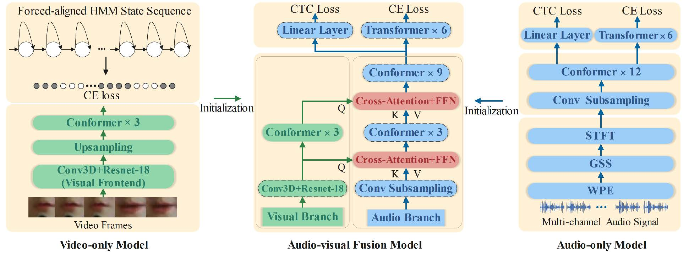
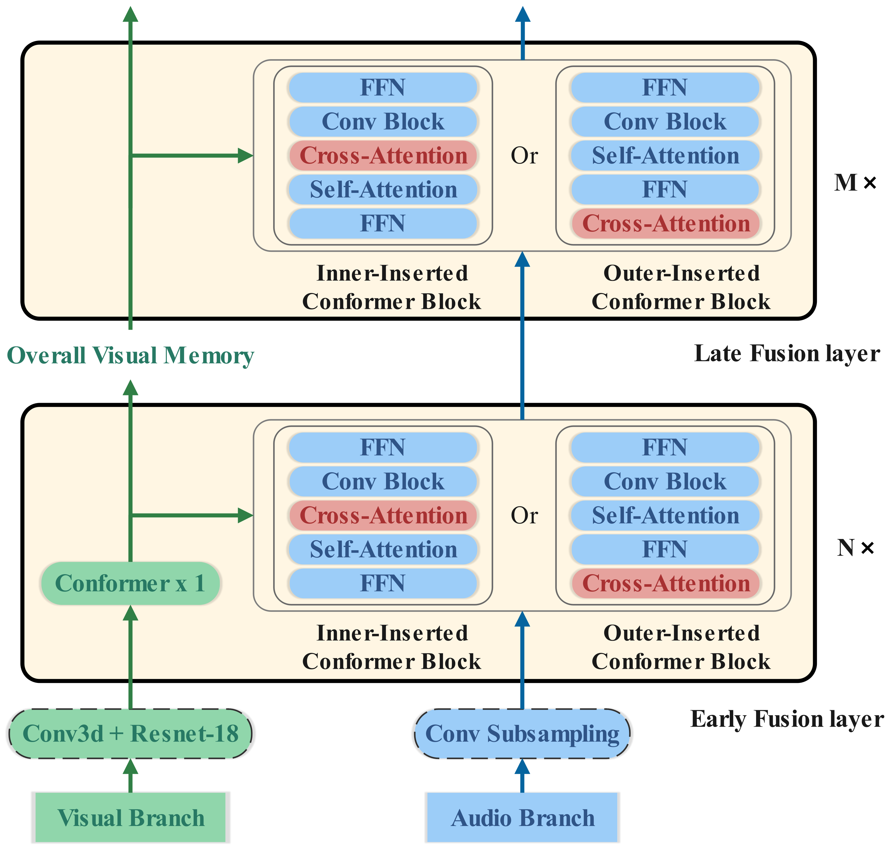
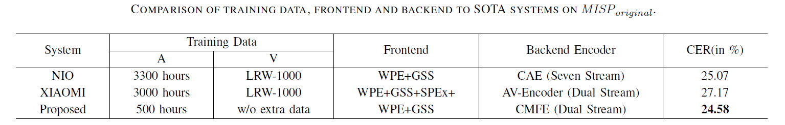

## Improving Audio-Visual Speech Recognition by Lip-Subword Correlation Based Visual Pre-training and Cross-Modal Fusion Encoder

- **Overview**  
[Paper](https://arxiv.org/pdf/2308.08488.pdf)

  In recent research, slight performance improvement  is observed from automatic speech recognition systems to audiovisual  speech recognition systems in end-to-end frameworks  with low-quality videos. Unmatching convergence rates and  specialized input representations between audio-visual modalities  are considered to cause the problem. In this paper, we propose  two novel techniques to improve audio-visual speech recognition (AVSR) under a pre-training and fine-tuning training framework. First, we explore the correlation between lip shapes and syllable-level  subword units in Mandarin through a frame-level subword  unit classification task with visual streams as input. The fine-grained  subword labels guide the network to capture temporal  relationships between lip shapes and result in an accurate  alignment between video and audio streams. Next, we propose  an audio-guided Cross-Modal Fusion Encoder (CMFE) to utilize  main training parameters for multiple cross-modal attention  layers to make full use of modality complementarity. Experiments  on the MISP2021-AVSR data set show the effectiveness of  the two proposed techniques. Together, using only a relatively  small amount of training data, the final system achieves better  performances than state-of-the-art systems with more complex  front-ends and back-ends. **In this repository, we release the PyTorch code of our work based on [Espnet](https://github.com/espnet/espnet) and [kaldi](https://github.com/kaldi-asr/kaldi).**

- **Training Pipeline**

  Uni-modal networks are first pre-trained and later integrated into a fusion model following unified fine-tuning. In the first stage, we pre-train a hybrid audio-only ASR CTC/Attention model. For the video modality, we explore a correlation between lip shapes and subword units to pre-train the video-only model. Then we initialize and fine-tune the audio-visual fusion model after the two unit-modal networks have converged.



- **Lip-Subword Correlation Based Visual Pre-training**

  We propose a subword-correlated visual pretraining  technique that does not need extra data or manually labeled  word boundaries.  We train a set of hidden Markov  models with Gaussian mixture model (GMM-HMMs) on far-field  audio to produce frame-level alignment labels and pre-train  the visual frontend by identifying each visual frame’s corresponding  syllable-related HMM states.  Compared to the pretraining  method based on end-to-end continuous lipreading,  our method explicitly offers syllable boundaries to establish  a direct frame-level mapping from lip shapes to syllables  in Mandarin.  These fine-grained alignment labels guide the  network to focus on learning visual feature extraction of low-quality  videos.  On the other hand, this pre-training method  could be viewed as a cross-modal conversion process that  accepts video frames as inputs and generates acoustic subword  sequences.  It is helpful to explore potential acoustic information  from lip movements and contributes to a good adaptation  process with the audio stream in the fusion stage.

- **Cross-modal fusion encoder**

  In the fusion stage of decoupled training, the initialized  audio and visual branches already have the fundamental ability  to extract uni-modal representations. Based on the straightforward  assumption that the audio modality contains more  linguistic information essential for ASR tasks. We propose a  novel CMFE block in which the audio modality dominates  and more training parameters of the network are used for  modality fusion modeling. As for the modality fusion structures,  motivated by the decoder architecture of the vanilla  transformer, the layer-wise cross-attention is designed in  different layers to make full use of modality complementarity.



## SOTA Comparison



## Code

**STEP1:** ```Run run_asr.sh to obtain the ASR system```

**STEP2: **```Run run_vsr_continous.sh | run_vsr_subword.sh to obtain the VSR system```

**STEP3:** ```Run run_ivsr_lipfarmid_triphone_lipfarmid_baseline.sh | run_ivsr_lipfarmid_triphone_lipfarmid_newcross_inner2.sh | 	run_ivsr_lipfarmid_triphone_lipfarmid_newcross_outter2.sh to obtain the AVSR system based on the pre-trained ASR and AVSR```

**TIPS:**

- For signal processing code, you could refer to [nara_wpe](https://github.com/fgnt/nara_wpe) | [cpu_gss](https://github.com/fgnt/pb_chime5) | [gpu_gss](https://github.com/desh2608/gss). In this paper, we use cpu_gss, but for futher experiment gpu_gss achieve a much better performance

- To generally force subwords labels for VSR training, you need to train a HMM-GMM.  The related code can be found in [misp2022baseline](https://github.com/mispchallenge/misp2022_baseline/tree/main/track2_AVDR).

## Citation

If you find this code useful in your research, please consider to cite the following papers:

```bibtex
@inproceedings{dai2023improving,
  title={Improving Audio-Visual Speech Recognition by Lip-Subword Correlation Based Visual Pre-training and Cross-Modal Fusion Encoder},
  author={Dai, Yusheng and Chen, Hang and Du, Jun and Ding, Xiaofei and Ding, Ning and Jiang, Feijun and Lee, Chin-Hui},
  booktitle={2023 IEEE International Conference on Multimedia and Expo (ICME)},
  pages={2627--2632},
  year={2023},
  organization={IEEE}
}
```
